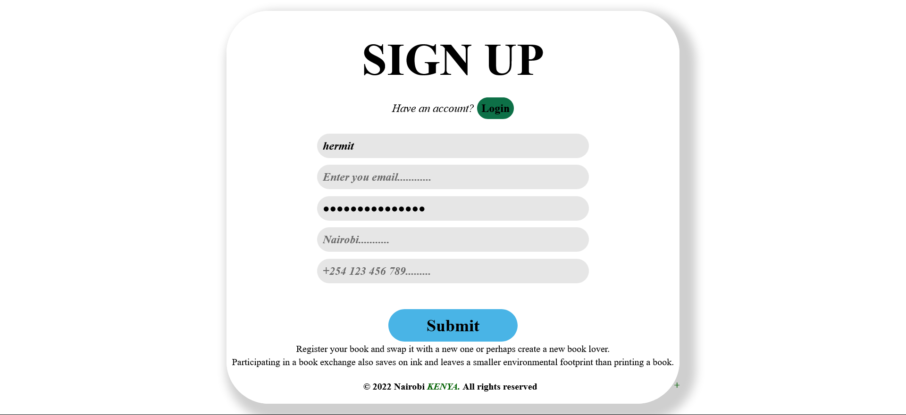
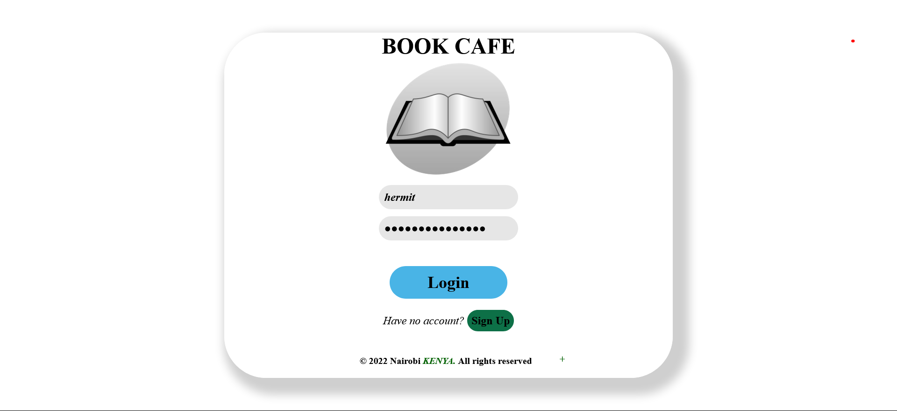
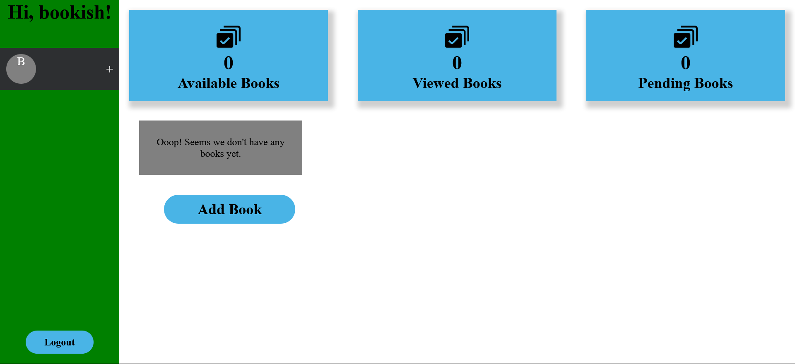
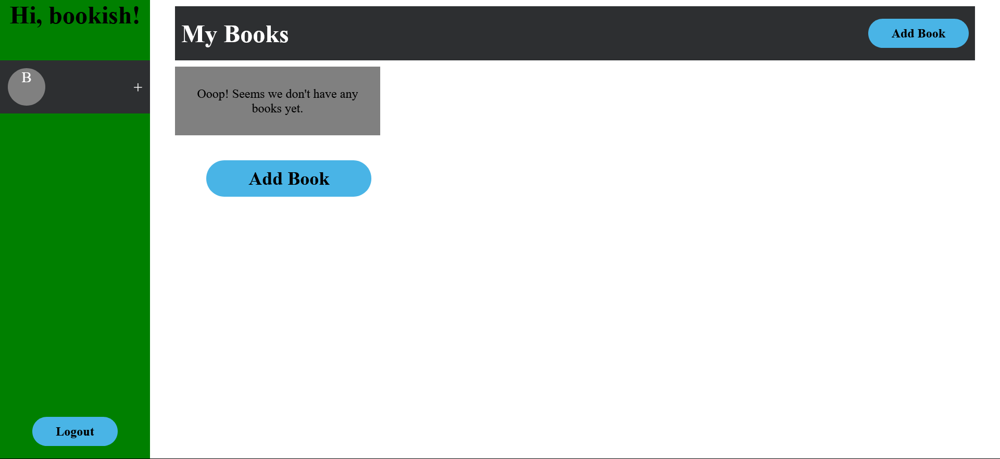
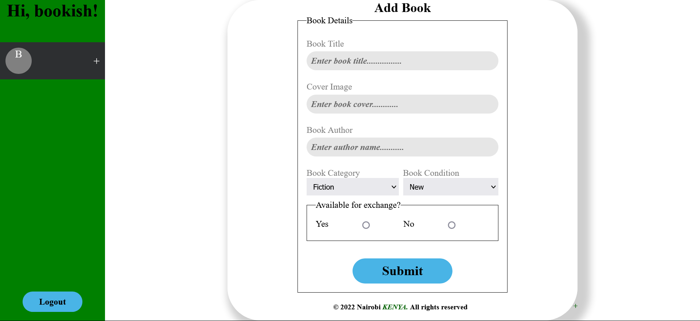
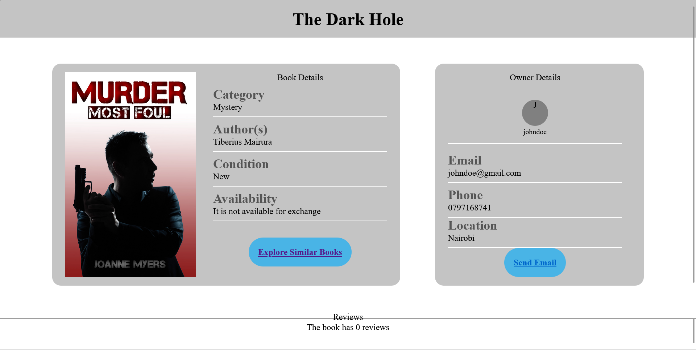

# Book Cafe

Book Cafe is a book exchange platform that allows book lovers to share books. Users are able to signup, and login. Once logged in, a user can view, upload, edit, delete and offer books for exchange with other users.

## Live Link
[Book Cafe](https://mybookcafe.herokuapp.com/)

## Users should be able to
- Create account
- Login/Logout
- Manage books
- Exchange books -> based on Genre/Topics
- List of books for exchange

Frontend Design (Figma)
Access the UI design [here](https://www.figma.com/file/Sk6MkMOlaR48b02Z6fvVBd/Untitled?node-id=0%3A1)
 on Figma

Here is the API [documentation](https://docs.google.com/document/d/1O1NqIGGSPto1wMrQ3-AzaYUFf8ow1lEj/edit)

## ERDs


## Class Diagrams


## Signup



## Login



## Home


## My Books


## add Book


## Book details


## Echange book


## Book
GET /books
returns a list of all books
GET /books/:id
return a book with corresponding id

if book does not exist, it returns:

``` json
{"error": `["Book not found"]`}
```
POST /books
creates a new book and returns the book created as JSON

if  wrong parameters are password, it returns:
``` json
{"errors": ["Invalid errors"]}

```
PATCH /books/:id
updates and returns a book with corresponding id

if book does not exist, it returns:

{"error": "Book not found"}
DELETE /books/:id
deletes a book with corresponding id

if book does not exist, it returns:
``` json
{"error": "Book not found"}
```


## User
GET /users
returns a list of all users
POST /signup
creates a new user and returns the book created as JSON

it also creates a new session for the user

if  wrong parameters are password, it returns:
``` json
{"errors": ["Invalid errors"]}
```
POST /me
checks if a user is logged in and returns the book created as JSON if so

if  user not logged in, it returns:

``` json
{"errors":  ["unauthorized"]}
```
PATCH /users/:id
updates and returns a user with corresponding id

if book does not exist, it returns:
``` json
{"error": "User not found"}
```
DELETE /users/:id
deletes a user with corresponding id along with all the associated records i.e books and reviews and ratings

if user does not exist, it returns:

``` json
{"error": "User not found"}
```


## BookExchange
GET /book_exchanges
returns a list of all books exchanged
GET /book_exchanges/:user_id
returns a list of all books exchanges by the user whose id is provided
POST /book_exchanges
creates a new exchange and returns the exchange information  as JSON

if  wrong parameters are password, it returns:
``` json
{"errors": ["Invalid errors"]}
```
PATCH /book_exchanges/:id
updates the exchange status and returns a exchange with corresponding id

if book does not exist, it returns:
``` json
{"error": "Exchange not found"}
```
DELETE /book_exchanges/:id
terminates a pending exchange with corresponding id

if user does not exist, it returns:
``` json
{"error": "User not found"}
```

## Technologies
### Front End
- ReactJS
- Material UI
- CSS


### Backend
- Ruby on Rails
- Postgresql

